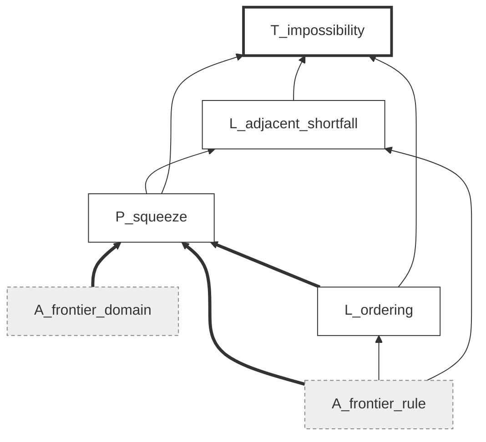

# Smoothing the Cliff: machine-checked proofs

Lean 4 development for the paper *Smoothing the Cliff: The Exact Price of
Eliminating Latency Races* (double-blind submission;
this repository carries no author information). Shipped here are the Lean
sources, the manifest carrying one node per paper statement
(`factgraph.toml`) with its checker (`factgraph.py`), and the exact-arithmetic
certificate behind the three-bidder proposition (`n3_witness/`).

## What we checked

The development contains 127 Lean source files and 1,816 theorem or lemma
declarations under `SmoothingCliff/`. A clean build completes 8,655 jobs with
no errors. The sources contain no `sorry` and no custom axiom; every
credentialed statement rests only on Lean's standard foundational axioms
`propext`, `Classical.choice`, and `Quot.sound`. The manifest has 170
non-assumption nodes, of which 120 carry a Lean credential. Five of the six
theorem nodes are among them.

The manifest records the remaining 50 nodes statement by statement. The
common-value general-*n* equilibrium classification and active-subset
construction remain analytic. The heterogeneous selection-free floor and the
profilewise dominance corollary are formalized in Lean. For the thick-market
comparison, Lean proves the order-statistic limit, sharp expected-loss rate,
integrated dissipation floor, and final comparison for every integrable
profile-level dissipation function satisfying the pointwise floor. It does
not construct a measurable space of mixed-strategy profiles or a
strategy-valued equilibrium selector. `prop:threebidders` and
`lem:gridinterp` use a 19×19 rational witness checked in exact arithmetic
outside Lean. The runtime claim is certified only at the counted-loop
cost-model level. The PL large-market limit and the declining-weight
mean-field program remain open. Literature correspondences are source-checked
rather than encoded as Lean theorems.

**What a credential is attached to.** A credential is issued against a pair:
the statement of a node, and the set of premises it stands on. The manifest
stores a fingerprint of that pair, and the checker recomputes it. Changing a
statement or rewiring a premise therefore invalidates the credential. This
check catches a formal theorem that still typechecks after its printed
statement or premise set has changed.

## The manifest as a graph

The manifest is a directed graph. One vertex represents each paper statement,
and an edge from *P* to *Q* records that the paper's proof of *Q* uses *P*. At
this revision it has 188 vertices and 333 edges: 18 assumptions, 112 lemmas,
42 propositions, 6 theorems, and 10 corollaries. Forty-eight vertices are
sources and 49 are sinks. The graph is acyclic, and a manifest containing a
cycle fails to load.

A credential is issued against a vertex together with its in-edges. We
fingerprint the pair consisting of a node's statement and its sorted premise
set, so the record for `prop:squeeze` reads

    sha256:df8635bdb863 = sha256("Every rule in class C obeys the paper's
    rank-wise allocation ceilings and floors." |
    A_frontier_domain,A_frontier_rule,L_ordering)

Editing the statement moves the fingerprint, and so does adding a premise,
dropping one, or rerouting an edge. The next `check` then refuses the
credential. The figure draws the dependency cone of `thm:impossibility` from
the manifest: six vertices and nine edges. Edges run from premise to
conclusion, so reading upward follows the paper's argument. Dashed boxes are
assumptions, which carry no credential by construction. The three bold edges
are the in-neighbourhood `P_squeeze` is fingerprinted against. Cones
elsewhere in the manifest run much wider, with 40 statements downstream of
`A_pl_process`.

**The two reachability queries.** Downstream, `blast <node>` returns the
descendant closure: what else falls if this statement falls. The assumptions
run large here. `A_pl_process`, the exponential-race process itself, reaches
41 of the 188 vertices. Upstream, `audit <node>` returns the ancestor closure
together with the credential state of every vertex in it, so we can see
whether the paper's route to a theorem passes through anything uncertified.
The longest chain in the graph runs 10 edges, from `A_pl_process` through the
tie-nullity, rank-interval and realized-priority bridges to `thm:stability`
and on to `cor:neartie_dominance`. At that length inspection stops being
reliable and the closure does the work.

**The manifest graph and Lean's.** Lean keeps a dependency graph of its own,
whose vertices are declarations, and enforces it directly: a Lean proof
cannot use a lemma that is not there. The verification work happens there,
and the manifest does none of it. What the manifest records is the *paper's*
argument structure. Keeping the two apart lets them disagree, and a
disagreement is informative. A theorem whose Lean proof is self-contained
still has premises in the paper; if those premises drift, the Lean credential
stays green while the manifest fingerprint breaks. Folding the two records
into one would lose that signal.

Degrees carry a different kind of information. The checker's `status` report
flags vertices with no descendants and four or more ancestors as costly but
load-bearing for nothing. The current graph has 23 such vertices. This is a
proportionality diagnostic, not a correctness test: a sound corollary can rest
on a deep chain and support no later result.

## Verification layers

The artifact uses three verification layers, matched to the claim type.

**Deductive claims, which we checked in Lean.** Theorems, propositions,
lemmas and the mathematical content of remarks assert implications from
stated premises. Five of the six theorems and 120 of the 170 non-assumption
statements tracked in the manifest are certified this way.

**Finite computations, which we checked in exact arithmetic.**
`prop:threebidders` is settled by a rational witness on a 19×19 grid, and
`lem:gridinterp` states the conditions that carry it to a rule in the
certified class. A standard-library exact-arithmetic checker verifies the
fixed table without floating-point operations. The paper therefore labels
the proposition computer-assisted.

**Empirical and interpretive statements.** Three kinds of statement are
outside the deductive development. The calibration to the Ethereum
builder auction reports facts about data, and whether the sampled slots are
representative is a question about the world rather than about a derivation.
The wedge table of `rem:plmeanfield` evaluates two closed forms at chosen
parameters; we can certify the formulas, not the choice of parameters. And
several remarks, on how to read the type, on the scope of the truthfulness
guarantee, and on adoption incentives, make no mathematical claim. The
manifest records the mathematical objects to which those discussions refer.

## The exact-arithmetic certificate

`n3_witness/` holds the rational certificate behind `prop:threebidders`. The
file `n3_R2_rational.json` stores the allocation coordinates on the 19×19
sorted-gap grid as exact rationals, and `verify_rational_witness.py` checks
the conditions listed in `lem:gridinterp` using Python's standard-library
`Fraction` arithmetic, with no floating point anywhere: total mass, ordering,
the two tie conditions, directional monotonicity along each of the three
bid-motion directions, the per-step Lipschitz bounds, the outer-band
agreement that makes the clamped extension admissible, and attainment of the
target value. Running it from that directory,

    python verify_rational_witness.py

prints

    PASS: exact 19x19 rational certificate
    target allocation=(Fraction(11, 12), Fraction(1, 12), Fraction(0, 1)), welfare=29/24

which is the value V₂ = 29/24 the proposition needs at (g₁, g₂) = (1/2, 3/4).
The interpolation lemma then carries the finite table to a rule in the
certified class, and that lemma is the piece we would ask a reader to check
by hand, since it is where a finite object becomes a global one.

## How to rerun the checks

The toolchain is pinned: Lean `leanprover/lean4:v4.30.0` and Mathlib at
revision `c5ea00351c28` (tag `v4.30.0`), reached through Econlib, vendored
under `vendor/Econlib` so the build is self-contained (see below). From the
repository root:

    lake build

A clean build reports 8,655 jobs and exits zero. A single file typechecks on
its own with `lake env lean <file>`, in seconds, writing nothing.

A green build establishes neither of the next two properties, so we check
them separately. The first is that nothing was assumed:

    #print axioms SmoothingCliff.Frontier.thm_impossibility

should print exactly `[propext, Classical.choice, Quot.sound]`. If `sorryAx`
shows up in that list, some proof in the dependency closure is incomplete;
any other name means a custom axiom was admitted somewhere. The second is
that the manifest is telling the truth:

    python factgraph.py factgraph.toml check

recomputes every fingerprint, reports any credential whose statement or
premise set has moved since it was issued, and rejects dangling references
and cycles in the dependency graph.

## Paper statements and their Lean counterparts

The table pairs each numbered result with the declaration carrying its
credential. Where a result has several clauses we name the declaration that
assembles them, and the manifest records the per-clause lemmas. The manifest
contains the full statement-by-statement correspondence and premise graph.

| Paper statement | Lean declaration | File |
|---|---|---|
| `thm:pos` | `minimax_welfare_lower_bound_certificate`, `waterFillingRule_welfare_loss_le` | `Frontier/WaterFilling.lean` |
| `thm:stability` | `finiteExponentialRaceTopKStability` | `Mechanism/StabilityBridge.lean` |
| `thm:sybil` | `maximalCoalitionGain_le_integral` | `Mechanism/Sybil.lean` |
| `thm:impossibility` | `thm_impossibility`, `no_pointwise_optimum_in_subclass` | `Frontier/RankRuleB.lean` |
| `thm:meanfield` | `certifiedRule_le_populationValue` (i), `postedRamp_solves_population_program` (ii), `rationedRampMap_frontier_populationValue` (iii) | `Frontier/InterimBridgeMeanField.lean`, `Frontier/PopulationProgram.lean`, `Frontier/GeneralRationingRate.lean` |
| `thm:thick-market-domination` | order-statistic, sharp loss-rate, integrated-floor, and induced-dissipation-function clauses: `expectedRunnerUp_tendsto_endpoint`, `eventually_sqrt_marketSize_mul_expectedWaterFillingLoss_le_sharp`, `expectedHeterogeneousWindowRawFloor_tendsto_endpoint`, `eventually_thickMarket_netSurplusGain_pos`; strategy-valued selector interface outside Lean | `Racing/ThickMarketOrderStatistics.lean`, `Racing/ThickMarketWaterFillingLoss.lean`, `Racing/ThickMarketDomination.lean` |
| `prop:frontier2` | `twoBidder_frontier` | `Frontier/TwoBidder.lean` |
| `prop:squeeze` | `ranked_squeeze_bounds` | `Frontier/Squeeze.lean` |
| `prop:responsiveness-budget` | `noRace_responsiveness_range` for the premise-minimal own-slice bound; `noRace_responsiveness_budget` for the cross-monotone general-profile cap | `Frontier/ResponsivenessBudget.lean` |
| `prop:sharpcertificate` | `uniformCertificateCoefficients_eq` | `Racing/SharpCertificate.lean` |
| `lem:spread` | `marginalValue_and_spread_bounds`, with the PL specialization in `plMarginalValue_and_spread_bounds` | `Racing/Spread.lean` |
| `prop:threebidders` | exact-arithmetic checker, outside Lean | `n3_witness/` |
| `prop:payment_identity` | `globalIsBIC_iff_paymentIdentity` | `Mechanism/Payments.lean` |
| `prop:revenue` | `totalPayment_tendsto_reserve_mul_mass` | `Mechanism/Revenue.lean` |
| `prop:luceopt` | `exponential_sequentialLuceWelfare_optimal`, `exponential_iidUnitExponential_expectedWelfare_optimal` | `Mechanism/LuceOptimalityGeneralK.lean` |
| `prop:sp_mixed` | `latticeExpectedStrictPriorityPayoff` | `Racing/MixedRace.lean` |
| `prop:sp_floor_n` | scalar algebra checked by SymPy and SMT; equilibrium argument outside Lean | manifest nodes `L_general_n_*` |
| `prop:sp_floor_hetero` | `heterogeneousSelectionFreeDissipation` | `Racing/HeterogeneousSelectionFreeFloor.lean` |
| unnumbered active-subset construction | analytic root-cdf argument, outside Lean | `L_general_n_root_cdf`, `L_general_n_active_subset` |
| `prop:sp_race` | pure clauses only (see above) | `Racing/RaceEquilibrium.lean` |
| `prop:rentdissipation` | three clauses, see manifest | `Racing/RentDissipation.lean` |
| `prop:budgetwf` | `budgetSpent_flatK_own_modulus_exact`, `budgetSpent_flatK_regret_exact`, `flatKWaterFillingSelection_oneSlot_local_regret_le` | `Frontier/FlatKMinimax.lean` |
| `prop:bounded-one-slot` | `boundedOneSlotFrontier_exact` | `Frontier/BoundedOneSlot.lean` |
| `lem:wf-profile-loss` | `waterFillAt_active_loss_identity`, `waterFillAt_loss_eq_zero_of_capped` | `Frontier/WaterFillingProfileLoss.lean` |
| `prop:flatK` | `flatKScoreFrontier_sandwich`, `flatKCubeFrontier_lower`, `flatK_frontier_ratio`; original capacity law in `flatK_waterFilling_loss_le` | `Frontier/FlatKMinimax.lean`, `Frontier/FlatK.lean` |
| `prop:flatK-sharp` | exact and SymPy certificates plus a sequential-proof audit; no Lean declaration | manifest nodes `L_flatK_six_orbit`, `L_flatK_rankgap_upper`, `L_flatK_ratio_40_39`, `P_flatK_40_39` |
| `cor:ir` | `globalReservePayment_interimIR` | `Mechanism/Payments.lean` |
| `cor:tight-K1` | `oneSlotLuceAllocation_lipschitz_eligible` | `Mechanism/OneSlotStability.lean` |
| `cor:cheap-latency-price` | `cheapLatencyFrontier_exact` over the class without cross-monotonicity, including the equality boundary; `cheapLatency_strictSlack_rule` | `Frontier/BoundedOneSlot.lean` |
| `cor:neartie_n` | common-value general-*n* equilibrium floor outside Lean; certificate and water-filling components credentialed separately | manifest node `C_neartie_n` |
| `cor:neartie_region` | `heterogeneousNash_nearTieDominance_active`, `heterogeneousNash_nearTieDominance_capped` | `Racing/HeterogeneousNearTieSelectionFree.lean` |
| `cor:pl-window-general-n` | `oneSlotPL_global_window_budget_at_tauCircle`, with centered-window attainment | `Mechanism/PLWindow.lean` |
| `cor:luceclass` | `luceClass_cap_equivalence_and_matched_premium` | `Mechanism/LuceClassCertificate.lean` |
| `rem:heteroweights` | first clause: `profileCertifiedRule_le_populationValue` | `Frontier/HeterogeneousWeights.lean` |
| `rem:plmeanfield` | feasibility and strictness: `plCurve_welfare_lt_populationValue` | `Frontier/PLMeanFieldCurve.lean` |
| `rem:coercivity` | `rentDissipation_finite_supremum_counterexample` | `Racing/RentDissipationCounterexample.lean` |
| `rem:wf_tight` | `waterFill_band_increment`, `hasDerivAt_waterFill_band` | `Frontier/BandDerivative.lean` |
| `rem:thick-random-scale` | analytic homogeneity extension, outside Lean | manifest node `R_thick_public_scale` |

## Where the Lean statement and the printed one differ

The following scope differences matter when reading the credentials.

**Feasibility of the certified class.** We encode membership in the certified
class by the permutohedron subset system Σᵢ∈H xᵢ ≤ W₍|H|₎ together with the
total-mass identity. The paper's own definition, existence of a lottery over
assignments inducing x, does not appear in the Lean statement. Every lottery
rule satisfies those inequalities, so the universal clauses of `prop:squeeze`
and `thm:impossibility` come out proved for a class at least as large as the
paper's, which makes them stronger than stated; the displaced-mass bound of
the inclusion-case capacity law `prop:flatK` is likewise certified for every
K-subset benchmark, with no top-K restriction, so it too is stronger than
printed. The two attainment clauses point the other way: exhibiting a rule in
the encoded class is weaker than exhibiting one in the paper's. Closing that
gap takes two steps. The first is Rado's theorem, that the permutohedron is
the convex hull of the permutations of the weight vector; Mathlib has
Birkhoff's theorem but not the majorization step before it, and we prove the
equal-weight case, the one the large-market section uses, by an induction on
fractional coordinates. The second is that a lottery has to be selected
measurably in the bid profile, which the paper does by fixing a lexicographic
basic feasible decomposition. A negative existential is not monotone in the
class, so this reaches the conclusion of `thm:impossibility` and not only its
attainment clauses, and we prove that conclusion for *every* class lying
between the two rules we exhibit and the encoded one. That reduces the whole
residue to a single statement: those two rules are lottery-implementable.

**The sharp incentive coefficient.** `prop:sharpcertificate` is formalized as
equality of the sets of admissible uniform window coefficients and uniform
Lipschitz coefficients for an arbitrary family of monotone allocation slices.
The extended-real supremum and infimum displayed in the paper present the
least common coefficient order-theoretically; they are not separate named
Lean declarations. `cor:sharpspeed` combines this equality with the utility
derivative identity. Its inputs are formalized, but the combined utility
statement is not packaged as one declaration.

**The flat-capacity minimax frontier.** The direct-score lower bounds in
`prop:flatK` are proved for every fixed-mass marginal rule satisfying the
stated full-vector modulus and uniform regret bound. The proof does not need
coordinate bounds. The bounded theorem assumes the rule only on `[0,1]^n`
and does not extend it beyond the cube. `prop:budgetwf` is formalized with its
exact general-*K* modulus, two-block worst case, and one-slot local spread
bound. Its displaced-mass inequality holds for every *K*-subset benchmark,
which is stronger than the printed top-*K* specialization.

**The heterogeneous floor.** The formal theorem allows nonnegative premia and
assumes only that the runner-up premium is positive, matching the printed
proposition. It is parameterized by an integer window depth *J* satisfying
*Jκ/w₁* ≤ 1; the paper takes *J* = ⌊*w₁/κ*⌋. The Lean result packages
equilibrium existence, the at-most-one-positive-payoff conclusion, and both
dissipation branches. The common-value simplification has a separate exact
symbolic credential in the manifest.

**The thick-market selector interface.** The Lean endpoint takes, at every
market size, an integrable measurable function from value profiles to realized
dissipation and assumes that it obeys the selection-free floor almost
everywhere. It proves the printed loss rate, limiting floor, and eventual
net-surplus comparison from that interface. The printed theorem starts one
level earlier, from a measurable selection of mixed-strategy equilibria. The
artifact does not define the measurable space of strategy profiles or
formalize the induced-dissipation map. This is the only unformalized step in
that theorem's dependency cone.

**The limit in `thm:meanfield`.** We prove the sandwich
V\*(W̄ₙ) − b̄w₁/(4√n) ≤ Vₙ(xᴿᴿ) ≤ V\*(W̄ₙ) at every n. We do not state the
concluding sentence, that per-capita value converges along a sequence with
W̄ₙ → W̄, as a limit, because getting there needs continuity of the program
value in the mass cap, and we have not proved that.

## Scope outside Lean

The 50 non-assumption nodes without a Lean credential fall into four groups.

**Analytic equilibrium arguments.** The common-value general-*n* floor and
the active-subset construction retain their analytic proofs. Their closed-form
identities and semialgebraic inequalities have SymPy and dual-solver checks.
By contrast, heterogeneous equilibrium existence, the zero-payoff
classification, exceptional-rent bound, shifted-window floor, and profilewise
dominance comparison are formalized in Lean. For the thick-market theorem,
the remaining equilibrium interface is the passage from a measurable
strategy-valued selector to its integrable profile-level dissipation function.
Lean quantifies the latter function directly.

**Finite and external checks.** `prop:threebidders` and `lem:gridinterp` use
the exact rational certificate described above. The mappings to the
Goldberg–Fanti–Shah frontier and to the order-statistic transformation in
Betto–Thomas are checked against the cited sources. These checks have their
own manifest layers and do not receive Lean tags.

**Library and implementation boundaries.** Clause (v) of `prop:sp_race` uses
an infinite-dimensional Kakutani–Fan–Glicksberg theorem not supplied by the
pinned libraries. Lottery implementability for declining slot weights uses
the majorization step in Rado's theorem and a measurable decomposition.
The implementation-complexity paragraph is formalized through its counted-loop
cost model; concrete heaps, samplers, and random-number generators are outside
the development.

**Compositions and open endpoints.** Several interpretations combine
credentialed inputs without a separate wrapper declaration. The finite-*n* sandwich in
`thm:meanfield` is formalized, while its concluding limit would additionally
require continuity of the population program in its mass cap. The PL
large-market limit and the general declining-weight mean-field program remain
open. The manifest records these endpoints separately.

## Findings

Formalization identified the following hypothesis, scope, and proof-route
issues. The printed statements and manifest incorporate the corresponding
repairs.

1. `prop:rentdissipation` (i) separates a hypothesis-free pointwise
   best-response bound from a uniform quantitative bound requiring unbounded
   marginal cost. `rem:coercivity` supplies a formal counterexample when that
   growth condition is dropped.
2. The band derivative in `rem:wf_tight` requires the active band to remain
   unchanged; on a stable band the own-bid map is locally affine.
3. For K ≥ 2, lowering one of K leaders to the tie level does not produce an
   n-way tie. The two lower bounds in `prop:flatK` instead use
   `prop:squeeze`; the Lean proof follows the same dependency.

## Scope of a machine credential

First, a credential says a Lean statement follows from Mathlib and the
standard axioms. It does not say that the Lean statement is a faithful
rendering of the English one. The manifest makes that translation auditable
by storing the English statement, premise set, credential layer, and
discharging declaration for every node.

Second, none of this speaks to whether the modelling assumptions are the
right ones, and none of it reaches the empirical sections. The calibration to
the Ethereum builder auction, the numerical wedge table of `rem:plmeanfield`
and the complexity claims below the cost model are all outside the formal
development.

Third, the proofs in the artifact are independent reconstructions rather than
transcriptions. Where we prove the same statement by a different route, the
paper's appendix proof is the one to read for intuition and the Lean proof
the one that has been checked. Two of ours are shorter than the paper's, and
one, the level-density representation of the second rank rule in
`thm:impossibility`, replaces a rank-by-rank case analysis with two scalar
monotonicity facts.

## Layout

- `SmoothingCliff/Basic.lean`: the reduced-form vocabulary: eligible
  profiles, interim rules, anonymity, monotonicity, Lipschitz caps,
  feasibility, welfare.
- `SmoothingCliff/Frontier/`: the responsiveness budget, exact bounded and
  unbounded one-slot frontiers, profilewise water-filling loss, pointwise
  impossibility, flat-capacity results, and the large-market program.
- `SmoothingCliff/Mechanism/`: the Plackett–Luce rule: axiomatization,
  monotonicity and payments, the arbitrary-*n* window budget, within-Luce
  optimality and logarithmic premium, revenue, and sybil bounds.
- `SmoothingCliff/Racing/`: the latency-investment game: spread bounds,
  heterogeneous mixed-equilibrium existence and selection-free floors,
  profilewise dominance, order statistics, and thick-market domination.
- `SmoothingCliff/Wrapper/`: the single-call payment wrapper certificates.
- `factgraph.toml`, `factgraph.py`: the statement manifest and its checker.
- `n3_witness/`: the exact-arithmetic certificate for `prop:threebidders`.
- `vendor/Econlib`: vendored dependency, see below.

## Vendored dependency

`vendor/Econlib` is a port of
[Econlib](https://github.com/danlyng/Econlib) (Apache License 2.0, upstream
revision `003655c`) to Lean 4.30.0 / mathlib v4.30.0; the upstream repository
does not yet carry this port, so the ported sources are vendored here with
the upstream license preserved in place. The development imports its
single-parameter Myerson machinery
(`Econlib.MechanismDesign.Transfers.SingleParameter.Screening`) and its
equilibrium existence interface (`Econlib.GameTheory.Equilibrium.Existence`).

## License

The `SmoothingCliff/` development, the manifest and the witness checker are
released under this repository's MIT license. The vendored `vendor/Econlib`
retains its own Apache-2.0 license.
