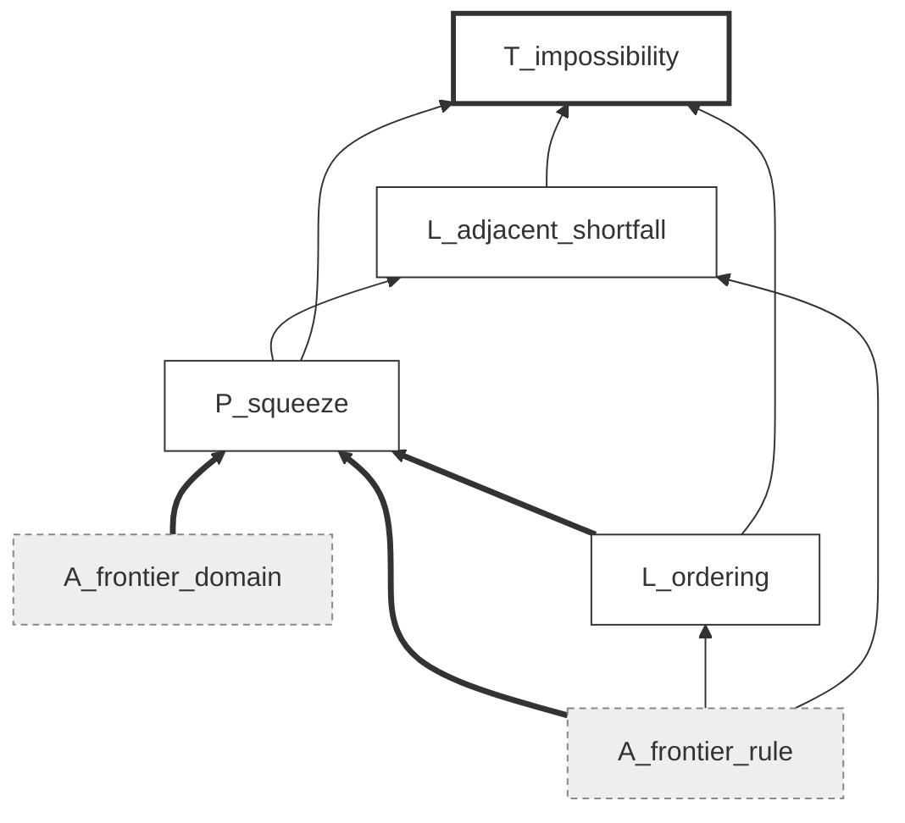

# Smoothing the Cliff — machine-checked proofs

Lean 4 development for the paper *Smoothing the Cliff: Priority Mechanism
Design under Allocation-Sensitivity Constraints* (double-blind submission;
this repository carries no author information). Shipped here are the Lean
sources, the manifest carrying one node per paper statement
(`factgraph.toml`) with its checker (`factgraph.py`), and the exact-arithmetic
certificate behind the three-bidder proposition (`n3_witness/`). The
credential ledger ships with the paper's supplementary artifact.

## What we checked

The state of things at this revision: 103 Lean files and 1,397 theorems in
`SmoothingCliff/`, building in 3,573 jobs with no errors, no `sorry`
anywhere, no custom axiom, and every credentialed statement resting only on
the three axioms of Lean's standard foundations, `propext`,
`Classical.choice` and `Quot.sound`. Of the 96 non-assumption statements in
the manifest, 88 carry a machine-checked credential, and all five theorems of
the paper are among them.

The eight without one are not silent omissions. Six are scope decisions.

- `prop:threebidders` and `lem:gridinterp` rest on a 19×19 rational witness
  that we check in exact arithmetic outside Lean, in `n3_witness/`.
- Clause (v) of `prop:sp_race`, existence of a mixed equilibrium, wants a
  Kakutani–Fan–Glicksberg theorem for locally convex spaces that neither
  Mathlib nor Econlib has.
- `prop:mechanism_runtime` we credentialed at the level of the counted-loop
  cost model and stopped there, short of formalizing concrete heap and
  sampler implementations.
- `prop:rho3` has its constant bridge and its upper bound certified, but its
  lower bound consumes the tradeoff and attainment facts from inside the
  three-bidder proof, so the node inherits the witness's standing rather
  than a Lean credential.
- `cor:luceclass` has its premium half certified as a composition of the
  within-Luce optimality and the matched log-trailer witness; the
  equivalence half rests on the recorded one-slot derivative computation and
  is not separately composed.

The remaining two are remarks whose statements contain problems the paper
itself leaves open, so we never expected them to go green in full: the clause
of `rem:heteroweights` past its first sentence, and the large-market limit
half of `rem:plmeanfield`. In both we credentialed whichever part of them
makes a claim.

**What a credential is attached to.** A credential is issued against a pair:
the statement of a node, and the set of premises it stands on. The manifest
stores a fingerprint of that pair and the checker recomputes it, so changing
a statement or rewiring a premise invalidates the credential mechanically,
with nobody having to remember to clear it. A formalization drifts away from
its paper quietly: the same English words come to rest on different
assumptions, and the credential ends up attached to a theorem nobody wrote.
The fingerprint turns that drift into a failed check.

## The manifest as a graph

The manifest is a directed graph. One vertex per paper statement, and an edge
from *P* to *Q* whenever the paper's proof of *Q* uses *P*. At this revision
it carries 106 vertices and 193 edges, of which 10 vertices are assumptions,
53 are lemmas, 33 propositions, 5 theorems and 5 corollaries. Fifteen
vertices are sources, resting on nothing declared inside the paper, and 27
are sinks, with nothing resting on them. The graph is acyclic, and a manifest
in which it is not fails to load.

A credential is issued against a vertex together with its in-edges. We
fingerprint the pair consisting of a node's statement and its sorted premise
set, so the record for `prop:squeeze` reads

    sha256:df8635bdb863 = sha256("Every rule in class C obeys the paper's
    rank-wise allocation ceilings and floors." |
    A_frontier_domain,A_frontier_rule,L_ordering)

Editing the statement moves the fingerprint, and so does adding a premise,
dropping one, or rerouting an edge. The next `check` then refuses the
credential. The figure draws the dependency cone of `thm:impossibility` from
the manifest: six vertices and nine edges. Edges run from premise to
conclusion, so reading upward follows the paper's argument. Dashed boxes are
assumptions, which carry no credential by construction. The three bold edges
are the in-neighbourhood `P_squeeze` is fingerprinted against. Cones
elsewhere in the manifest run much wider, with 40 statements downstream of
`A_pl_process`.

**The two reachability queries.** Downstream, `blast <node>` returns the
descendant closure: what else falls if this statement falls. The assumptions
run large here. `A_pl_process`, the exponential-race process itself, reaches
40 of the 106 vertices. Upstream, `audit <node>` returns the ancestor closure
together with the credential state of every vertex in it, so we can see
whether the paper's route to a theorem passes through anything uncertified.
The longest chain in the graph runs 10 edges, from `A_pl_process` through the
tie-nullity, rank-interval and realized-priority bridges to `thm:stability`
and on to `cor:neartie_dominance`. At that length inspection stops being
reliable and the closure does the work.

**The manifest graph and Lean's.** Lean keeps a dependency graph of its own,
whose vertices are declarations, and enforces it directly: a Lean proof
cannot use a lemma that is not there. The verification work happens there,
and the manifest does none of it. What the manifest records is the *paper's*
argument structure. Keeping the two apart lets them disagree, and a
disagreement is informative. A theorem whose Lean proof is self-contained
still has premises in the paper; if those premises drift, the Lean credential
stays green while the manifest fingerprint breaks. Folding the two records
into one would lose that signal.

Degrees carry a different kind of information. The checker's `status` report
flags vertices with no descendants and four or more ancestors as costly but
load-bearing for nothing. Nothing about correctness follows: a corollary that
rests on a deep chain and supports nothing is fine as mathematics and
expensive as effort. We looked at each and kept all of them. The graph is
what raised the question.

## Not everything wants a proof assistant

A reader who takes Lean coverage as the only measure of rigour will misread
what is here. The claims come in three kinds, and we pointed a different
instrument at each.

**Deductive claims, which we checked in Lean.** Theorems, propositions,
lemmas and the mathematical content of remarks all assert that something
follows from something else. A proof assistant helps most here, because the
failure it catches, a step that does not follow, is the failure a careful
reader slides past. All five theorems and 88 of the 96 statements tracked in
the manifest are certified this way.

**Finite computations, which we checked in exact arithmetic.**
`prop:threebidders` is settled by a rational witness on a 19×19 grid, and
`lem:gridinterp` states the conditions that carry it to a rule in the
certified class. Checking a fixed finite table of rationals is not something
a proof assistant does better than exact rational arithmetic already does;
porting the checker into Lean would transcribe a computation without adding
information, since the arithmetic is exact and the table is fixed. That is
why the paper labels the proposition computer-assisted.

**Claims that are not deductive at all.** Three kinds of statement in the
paper sit outside the reach of any formal system, and their absence from the
manifest is not a hole in our coverage. The calibration to the Ethereum
builder auction reports facts about data, and whether the sampled slots are
representative is a question about the world rather than about a derivation.
The wedge table of `rem:plmeanfield` evaluates two closed forms at chosen
parameters; we can certify the formulas, not the choice of parameters. And
several remarks, on how to read the type, on the scope of the truthfulness
guarantee, and on adoption incentives, make no mathematical claim at all.
What a formalization can do for these is pin down which mathematical object
the discussion is about, and the manifest records that much.

## The exact-arithmetic certificate

`n3_witness/` holds the rational certificate behind `prop:threebidders`. The
file `n3_R2_rational.json` stores the allocation coordinates on the 19×19
sorted-gap grid as exact rationals, and `verify_rational_witness.py` checks
the conditions listed in `lem:gridinterp` using Python's standard-library
`Fraction` arithmetic, with no floating point anywhere: total mass, ordering,
the two tie conditions, directional monotonicity along each of the three
bid-motion directions, the per-step Lipschitz bounds, the outer-band
agreement that makes the clamped extension admissible, and attainment of the
target value. Running it from that directory,

    python verify_rational_witness.py

prints

    PASS: exact 19x19 rational certificate
    target allocation=(Fraction(11, 12), Fraction(1, 12), Fraction(0, 1)), welfare=29/24

which is the value V₂ = 29/24 the proposition needs at (g₁, g₂) = (1/2, 3/4).
The interpolation lemma then carries the finite table to a rule in the
certified class, and that lemma is the piece we would ask a reader to check
by hand, since it is where a finite object becomes a global one.

## How to rerun the checks

The toolchain is pinned: Lean `leanprover/lean4:v4.30.0` and Mathlib at
revision `c5ea00351c28` (tag `v4.30.0`), reached through Econlib, vendored
under `vendor/Econlib` so the build is self-contained (see below). From the
repository root:

    lake build

A clean build reports 3,573 jobs and exits zero. A single file typechecks on
its own with `lake env lean <file>`, in seconds, writing nothing.

A green build establishes neither of the next two properties, so we check
them separately. The first is that nothing was assumed:

    #print axioms SmoothingCliff.Frontier.thm_impossibility

should print exactly `[propext, Classical.choice, Quot.sound]`. If `sorryAx`
shows up in that list, some proof in the dependency closure is incomplete;
any other name means a custom axiom was admitted somewhere. The second is
that the manifest is telling the truth:

    python factgraph.py factgraph.toml check

recomputes every fingerprint, reports any credential whose statement or
premise set has moved since it was issued, and rejects dangling references
and cycles in the dependency graph.

## Paper statements and their Lean counterparts

The table pairs each numbered result with the declaration carrying its
credential. Where a result has several clauses we name the declaration that
assembles them, and the manifest records the per-clause lemmas. The full
correspondence, including the two hundred or so supporting lemmas, is in the
manifest and the ledger shipped with the paper's artifact.

| Paper statement | Lean declaration | File |
|---|---|---|
| `thm:pos` | `minimax_welfare_lower_bound_certificate`, `waterFillingRule_welfare_loss_le` | `Frontier/WaterFilling.lean` |
| `thm:stability` | `finiteExponentialRaceTopKStability` | `Mechanism/StabilityBridge.lean` |
| `thm:sybil` | `maximalCoalitionGain_le_integral` | `Mechanism/Sybil.lean` |
| `thm:impossibility` | `thm_impossibility`, `no_pointwise_optimum_in_subclass` | `Frontier/RankRuleB.lean` |
| `thm:meanfield` | `certifiedRule_le_populationValue` (i), `postedRamp_solves_population_program` (ii), `rationedRampMap_frontier_populationValue` (iii) | `Frontier/InterimBridgeMeanField.lean`, `Frontier/PopulationProgram.lean`, `Frontier/GeneralRationingRate.lean` |
| `prop:frontier2` | `twoBidder_frontier` | `Frontier/TwoBidder.lean` |
| `prop:squeeze` | `ranked_squeeze_bounds` | `Frontier/Squeeze.lean` |
| `prop:threebidders` | exact-arithmetic checker, outside Lean | `n3_witness/` |
| `prop:payment_identity` | `globalIsBIC_iff_paymentIdentity` | `Mechanism/Payments.lean` |
| `prop:revenue` | `totalPayment_tendsto_reserve_mul_mass` | `Mechanism/Revenue.lean` |
| `prop:extraction` | `extraction_gap_le` | `Frontier/Extraction.lean` |
| `prop:sp_mixed` | `latticeExpectedStrictPriorityPayoff` | `Racing/MixedRace.lean` |
| `prop:sp_allequilibria` | `positive_payoff_classification_unconditional`, `positiveProfile_equilibrium` | `Racing/NextSupport.lean`, `Racing/PositiveProfile.lean` |
| `prop:sp_floor` | `nash_dissipation_ge_prize_net_cost` | `Racing/BoundaryFloor.lean` |
| `prop:sp_race` | pure clauses only (see above) | `Racing/RaceEquilibrium.lean` |
| `prop:exact_threshold` | `existsUnique_boundaryRunUpAverage_maximizer` | `Racing/RunUpAverage.lean` |
| `prop:netsurplus` | `heterogeneous_pureNash_netSurplus_le` | `Racing/NetSurplus.lean` |
| `prop:netsurplus_n` | `plLaw_netSurplus_dominates_strictPriority` | `Racing/NetSurplusGeneralN.lean` |
| `prop:rentdissipation` | three clauses, see manifest | `Racing/RentDissipation.lean` |
| `prop:optcert` | four clauses, see manifest | `Racing/OptimalCap.lean` |
| `prop:mechanism_runtime` | cost model only | `Mechanism/Runtime.lean` |
| `prop:flatK` | `flatK_waterFilling_loss_le` and four companion declarations | `Frontier/FlatK.lean` |
| `prop:rho3` | constant bridge and upper bound: `shortfall_bridge_units`, `rho3_upper_certificate` | `Frontier/ConsistencyGap.lean` |
| `cor:ir` | `globalReservePayment_interimIR` | `Mechanism/Payments.lean` |
| `cor:tight-K1` | `oneSlotLuceAllocation_lipschitz_eligible` | `Mechanism/OneSlotStability.lean` |
| `cor:neartie_dominance` | `neartie_dominance` | `Racing/NearTieDominance.lean` |
| `cor:luceclass` | premium half: `luceClass_matched_log_premium` | `Mechanism/LuceClass.lean` |
| `rem:sybilsign` | `twoIdentityTruthfulGain_strictPriority_dichotomy` | `Mechanism/SybilStrictPriority.lean` |
| `rem:heteroweights` | first clause: `profileCertifiedRule_le_populationValue` | `Frontier/HeterogeneousWeights.lean` |
| `rem:plmeanfield` | feasibility and strictness: `plCurve_welfare_lt_populationValue` | `Frontier/PLMeanFieldCurve.lean` |
| `rem:rentcap` | `positive_payoff_le_cost_band_of_support` | `Racing/SupportBound.lean` |
| `rem:coercivity` | `rentDissipation_finite_supremum_counterexample` | `Racing/RentDissipationCounterexample.lean` |
| `rem:kernel` | `halfL1_scaleDensity_le_cg`, `uniform_not_le_varA_only` | `Wrapper/ScaleKernelTV.lean` |
| `rem:wf_tight` | `waterFill_band_increment`, `hasDerivAt_waterFill_band` | `Frontier/BandDerivative.lean` |
| `rem:constant` | `certificate_independent_of_mass`, `oneSlot_constant_lt_general` | `Mechanism/CertificateStructure.lean` |

## Where the Lean statement and the printed one differ

In three places the two statements are close without being identical.

**Feasibility of the certified class.** We encode membership in the certified
class by the permutohedron subset system Σᵢ∈H xᵢ ≤ W₍|H|₎ together with the
total-mass identity. The paper's own definition, existence of a lottery over
assignments inducing x, does not appear in the Lean statement. Every lottery
rule satisfies those inequalities, so the universal clauses of `prop:squeeze`
and `thm:impossibility` come out proved for a class at least as large as the
paper's, which makes them stronger than stated; the displaced-mass bound of
the inclusion-case capacity law `prop:flatK` is likewise certified for every
K-subset benchmark, with no top-K restriction, so it too is stronger than
printed. The two attainment clauses point the other way: exhibiting a rule in
the encoded class is weaker than exhibiting one in the paper's. Closing that
gap takes two steps. The first is Rado's theorem, that the permutohedron is
the convex hull of the permutations of the weight vector; Mathlib has
Birkhoff's theorem but not the majorization step before it, and we prove the
equal-weight case, the one the large-market section uses, by an induction on
fractional coordinates. The second is that a lottery has to be selected
measurably in the bid profile, which the paper does by fixing a lexicographic
basic feasible decomposition. A negative existential is not monotone in the
class, so this reaches the conclusion of `thm:impossibility` and not only its
attainment clauses, and we prove that conclusion for *every* class lying
between the two rules we exhibit and the encoded one. That reduces the whole
residue to a single statement: those two rules are lottery-implementable.

**The limit in `thm:meanfield`.** We prove the sandwich
V\*(W̄ₙ) − b̄w₁/(4√n) ≤ Vₙ(xᴿᴿ) ≤ V\*(W̄ₙ) at every n. We do not state the
concluding sentence, that per-capita value converges along a sequence with
W̄ₙ → W̄, as a limit, because getting there needs continuity of the program
value in the mass cap, and we have not proved that.

**`rem:kernel`, where the mistake was ours.** The scale-family bound is
certified. The interesting part is which route reaches it, because we first
took a different one and misdiagnosed the remark as a result. A direct
two-scale comparison pays for the moving support with the supremum of the
density near the endpoint, where the printed constant carries only the
endpoint limit; the two diverge as soon as the density has an interior peak,
and for a while we recorded the remark as missing a hypothesis. Nothing is
missing. The remark never compares two scales directly: it computes the local
rate and integrates it along reports, half the total variation is a metric
and hence subadditive along a chain of intermediate scales, and in the
refinement limit the endpoint bound serves every step. What carries a
credential is now the printed statement under the printed hypotheses. The
remark's closing sentence we check separately, and it survives: dropping the
boundary term makes the bound false, with the uniform kernel as witness.

## Six things that resisted formalization

**Missing from the libraries.** Three want a theorem that neither Mathlib nor
Econlib has. Clause (v) of `prop:sp_race` wants Kakutani–Fan–Glicksberg for
locally convex spaces: strategies are distributions over a continuum of
actions, so the strategy space is infinite dimensional, while the available
Kakutani theorem is stated for finite-dimensional normed spaces. The lottery
formulation of the certified class with declining slot weights wants Rado's
theorem; Mathlib has Birkhoff's theorem but not the majorization step that
precedes it, so the chain stops one link short, and we prove the equal-weight
case from scratch. And the first half of `rem:plmeanfield` wants
concentration for the Kₙ-th order statistic of an exponential race, which
the libraries do not supply in a usable form.

**No obstacle, we just did not do it.** Two were within reach and we did not
reach them. A lottery has to be selected measurably in the bid profile, which
the paper does by fixing a lexicographic basic feasible decomposition;
nothing blocks formalizing that and we did not attempt it. The concluding
limit of `thm:meanfield` needs continuity of the program value in the mass
cap, an ordinary real-analysis statement that our development does not
contain.

**Deliberately out of scope.** `prop:mechanism_runtime` is certified at the
level of an explicit cost model with its asymptotic relations. Going further
would mean formalizing a concrete heap, a sampler and a random number
generator. That is a project about standard data structures, and the
certificate at the end of it would say nothing further about the paper's
claim.

**What these absences mean.** One in the first group is a fact about the
state of the libraries, and it will close as they grow. One in the second is
a fact about how we spent our time. One in the third is our judgment that the
marginal certificate is not worth its cost. None of them says the underlying
mathematics is in doubt. Every one of these statements has an ordinary proof
in the paper, and the formalization's silence about it is silence, not
dissent.

## Findings

None of this was a stamp applied at the end. Attempting the proofs turned up
defects and the paper was rewritten around each of them.

1. Clause (i) of `prop:rentdissipation` was refuted as originally stated. It
   now separates a hypothesis-free pointwise bound from a quantitative bound
   carrying an explicit unbounded-marginal-cost hypothesis, and
   `rem:coercivity` records that the hypothesis cannot be dropped, on the
   strength of the counterexample the formalization produced
   (`Racing/RentDissipationCounterexample.lean`).
2. The strict-priority clause of `rem:sybilsign` asserted that the
   two-identity gain vanishes. A machine-checked counterexample shows it
   equals −w₁(v−r) against no eligible opponent, so the clause was rewritten
   as a limit depending on the opponents' top order statistic. Both branches
   are now proved.
3. A missing ordering hypothesis surfaced while proving a positive-part
   monotonicity step: the case analysis left exactly the two goals the
   hypothesis supplies. The statement now carries both, and a downstream
   burden statement was weakened from monotone to monotone on the
   nonnegative caps.
4. Two remarks turned out to be stating an identity without its side
   condition. The band derivative of `rem:wf_tight` holds when the
   perturbation leaves the active band intact, which a large enough increment
   does not; our statement carries that condition. The negative claims of
   `rem:constant` we state as a contrast between two profiles, since the
   identity their phrasing invites is a tautology.
5. `rem:kernel` we recorded for a time as missing a boundary hypothesis. It
   is not; the section above gives the correction. We keep the episode in the
   record because the failure mode goes unremarked: a formalization can fail
   to reproduce a correct argument, and the note it leaves behind reads like
   a defect report.
6. The printed proof of part (i) of the inclusion-case capacity law
   `prop:flatK` originally lowered one of K leaders to the tie level and
   claimed an n-way tie, which is false for K ≥ 2. The defect was caught
   while preparing the formalization; both lower bounds now route through
   `prop:squeeze`, whose Lean counterparts they reuse.

## Limits of a machine credential

First, a credential says a Lean statement follows from Mathlib and the
standard axioms. It does not say the Lean statement is a faithful rendering
of the English one. That translation is our work rather than the machine's,
and it is where an error would hide. We wrote the manifest so this layer can
be audited: every node stores the English statement, the premise set and the
declaration that discharges it, and every ledger entry says in prose what was
proved and what was assumed.

Second, none of this speaks to whether the modelling assumptions are the
right ones, and none of it reaches the empirical sections. The calibration to
the Ethereum builder auction, the numerical wedge table of `rem:plmeanfield`
and the complexity claims below the cost model are all outside the formal
development.

Third, the proofs in the artifact are independent reconstructions rather than
transcriptions. Where we prove the same statement by a different route, the
paper's appendix proof is the one to read for intuition and the Lean proof
the one that has been checked. Two of ours are shorter than the paper's, and
one, the level-density representation of the second rank rule in
`thm:impossibility`, replaces a rank-by-rank case analysis with two scalar
monotonicity facts.

## Layout

- `SmoothingCliff/Basic.lean` — the reduced-form vocabulary: eligible
  profiles, interim rules, anonymity, monotonicity, Lipschitz caps,
  feasibility, welfare.
- `SmoothingCliff/Frontier/` — the welfare frontier under the cap: the
  two-bidder envelope, squeeze bounds, the pointwise impossibility, the
  minimax rate and water-filling, the inclusion-case capacity law, the
  consistency gap, and the large-market program.
- `SmoothingCliff/Mechanism/` — the Plackett–Luce rule: axiomatization,
  monotonicity and payments, own- and cross-bid stability certificates,
  within-Luce optimality, revenue and sybil bounds.
- `SmoothingCliff/Racing/` — the latency-investment game: the spread lemma,
  rent dissipation, the strict-priority equilibrium classification, net
  surplus, and the optimal published cap.
- `SmoothingCliff/Wrapper/` — the single-call payment wrapper certificates.
- `factgraph.toml`, `factgraph.py` — the statement manifest and its checker.
- `n3_witness/` — the exact-arithmetic certificate for `prop:threebidders`.
- `vendor/Econlib` — vendored dependency, see below.

## Vendored dependency

`vendor/Econlib` is a port of
[Econlib](https://github.com/danlyng/Econlib) (Apache License 2.0, upstream
revision `003655c`) to Lean 4.30.0 / mathlib v4.30.0; the upstream repository
does not yet carry this port, so the ported sources are vendored here with
the upstream license preserved in place. The development imports its
single-parameter Myerson machinery
(`Econlib.MechanismDesign.Transfers.SingleParameter.Screening`) and its
equilibrium existence interface (`Econlib.GameTheory.Equilibrium.Existence`).

## License

The `SmoothingCliff/` development, the manifest and the witness checker are
released under this repository's MIT license. The vendored `vendor/Econlib`
retains its own Apache-2.0 license.
